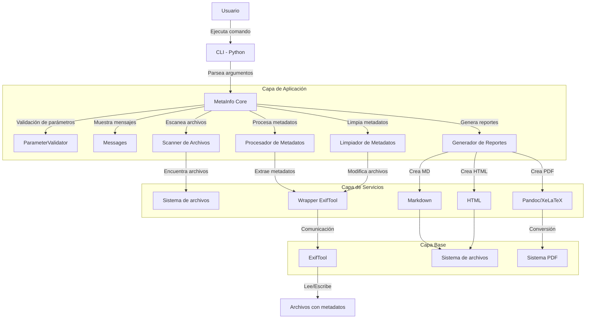

# MetaInfo

MetaInfo es una herramienta para inspeccionar y manipular metadatos de archivos. Permite generar informes detallados de metadatos y también eliminar metadatos de archivos de forma recursiva.

## Características

- **Análisis recursivo**: Procesa archivos en el directorio especificado y todas sus subcarpetas
- **Generación de informes**: Crea informes en formato Markdown, HTML y opcionalmente PDF con portada profesional e índice
- **Limpieza de metadatos**: Elimina todos los metadatos o solo aquellos considerados sensibles
- **Detección multilingüe**: Detecta información sensible en español, inglés, francés, alemán, italiano y portugués
- **Formatos soportados**: Imágenes (JPG, PNG, GIF, WEBP, BMP), documentos (PDF, DOCX, ODT, XLS, XLSX, PPT, PPTX), multimedia (MP3, MP4, AVI, MOV, WMV, FLV) y más
- **Manejo robusto de errores**: Sistema centralizado de mensajes y validación de parámetros

## Basado en ExifTool

MetaInfo se basa en ExifTool, una potente biblioteca de código abierto que permite leer, escribir y manipular metadatos en una amplia variedad de archivos. ExifTool es capaz de extraer información técnica y metadatos de miles de tipos de archivo diferentes, incluyendo:

- Metadatos EXIF en imágenes (fecha, hora, configuración de cámara, ubicación GPS)
- Información de autor y copyright en documentos
- Datos técnicos en archivos multimedia
- Metadatos personalizados en diversos formatos de archivo

MetaInfo amplía las capacidades de ExifTool proporcionando una interfaz más amigable, generación automatizada de informes y funciones específicas para la detección y eliminación de información sensible.

## Arquitectura y Flujo de Ejecución

El siguiente diagrama muestra la arquitectura y el flujo de ejecución de MetaInfo:



Este diagrama representa:
1. El usuario interactúa con la interfaz de línea de comandos (CLI)
2. La aplicación parsea los argumentos y activa el núcleo de MetaInfo
3. ParameterValidator verifica y completa los parámetros necesarios
4. Messages proporciona una interfaz centralizada para todos los mensajes al usuario
5. MetaInfo utiliza diferentes módulos según la tarea solicitada
6. Estos módulos se comunican con servicios de nivel inferior
7. En la base, ExifTool realiza las operaciones de lectura/escritura de metadatos
8. Pandoc y XeLaTeX se utilizan opcionalmente para la generación de PDF con portada e índice

Para un análisis más detallado de la arquitectura del sistema, consulta el [diagrama de arquitectura de capas](docs/arquitectura_capas.md).

## Clases Principales

MetaInfo sigue una arquitectura modular con las siguientes clases principales:

- **MetaInfo**: Clase principal que maneja la entrada del usuario y coordina el procesamiento
- **Main**: Clase central que gestiona las operaciones principales sobre archivos y metadatos
- **Reporter**: Genera informes en formatos Markdown, HTML y PDF
- **Cleaner**: Maneja la limpieza de metadatos de archivos
- **Messages**: Centraliza todos los mensajes del sistema y proporciona métodos para mostrarlos
- **ParameterValidator**: Valida y asegura la consistencia de los parámetros de entrada
- **SupportedExtensions**: Define las extensiones de archivo soportadas
- **SensitivePatterns**: Define los patrones considerados sensibles para la detección

## Diseño y Documentación Técnica

Para proporcionar una comprensión completa del diseño del sistema, se han creado diversos documentos técnicos que abordan diferentes aspectos de la arquitectura:

- **[Modelo de Dominio](docs/modelo_dominio.md)**: Presenta las entidades principales del sistema y sus relaciones desde una perspectiva de negocio.

- **[Arquitectura de Capas](docs/arquitectura_capas.md)**: Muestra la organización del sistema en capas, desde la interfaz de usuario hasta la infraestructura.

- **[Diagrama de Clases](docs/diagrama_clases.md)**: Proporciona un diseño estático detallado de las clases del sistema, con sus atributos, métodos y relaciones.

- **[Diagrama de Flujo de Datos](docs/diagrama_flujo_datos.md)**: Ilustra cómo fluye la información a través del sistema, desde la entrada hasta la generación de informes o limpieza.

- **[Arquitectura Modular](docs/arquitectura_modular.md)**: Presenta una vista modular del sistema, mostrando los componentes principales y cómo interactúan entre sí.

- **[Casos de Uso](docs/casos_uso.md)**: Describe detalladamente los diversos casos de uso del sistema y proporciona escenarios prácticos para diferentes perfiles de usuario.

- **[Diagramas de Interacción](docs/diagramas_interaccion.md)**: Muestra el comportamiento dinámico del sistema mediante diagramas de secuencia, colaboración y estados.

Estos documentos técnicos facilitan la comprensión del sistema tanto para nuevos desarrolladores como para usuarios avanzados interesados en su funcionamiento interno.

## Requisitos

- Python 3.6 o superior
- Biblioteca exiftool para Python (`pip install PyExifTool>=0.5.6`)
- ExifTool instalado en el sistema (versión 12.15 o superior)
- PyYAML (`pip install pyyaml>=6.0`) para procesamiento de configuración
- Pillow (`pip install pillow>=9.0.0`) para procesamiento de imágenes
- Markdown (`pip install markdown>=3.5.0`) para procesamiento de texto
- PyPandoc (`pip install pypandoc>=1.12`) para conversión a PDF
- Pandoc y XeLaTeX instalados en el sistema (para generación de PDF)

## Instalación

### 1. Instalar ExifTool

#### En sistemas basados en Debian/Ubuntu:
```bash
sudo apt install libimage-exiftool-perl
```

#### En sistemas basados en RHEL/CentOS:
```bash
sudo yum install perl-Image-ExifTool
```

#### En Windows o Mac:
Descarga e instala desde la [página oficial de ExifTool](https://exiftool.org/)

### 2. Instalar Pandoc y XeLaTeX (requerido para generación de PDF)

#### En sistemas basados en Debian/Ubuntu:
```bash
sudo apt install pandoc texlive-xetex texlive-latex-extra texlive-fonts-recommended texlive-lang-spanish
```

#### En sistemas basados en RHEL/CentOS:
```bash
sudo yum install pandoc texlive-xetex texlive-latex-extra texlive-collection-fontsrecommended texlive-collection-langspanish
```

#### En Windows o Mac:
Descarga e instala desde la [página oficial de Pandoc](https://pandoc.org/installing.html) y [TeX Live](https://www.tug.org/texlive/) o [MiKTeX](https://miktex.org/)

### 3. Clonar el repositorio e instalar dependencias de Python

```bash
git clone https://github.com/tu-usuario/metainfo.git
cd metainfo
pip install -r requirements.txt
```

### 4. Verificar dependencias

Para verificar que todas las dependencias necesarias están instaladas:

```bash
make check-dependencies
```

O para instalar automáticamente las dependencias de desarrollo (recomendado para contribuyentes):

```bash
make requirements-dev
```

## Uso

### Generar un informe completo de metadatos

```bash
python metainfo.py --i /ruta/a/carpeta --report_all
```

### Generar un informe solo con datos sensibles

```bash
python metainfo.py --i /ruta/a/carpeta --report_sensitive
```

### Generar un informe en PDF con portada e índice

```bash
python metainfo.py --i /ruta/a/carpeta --report_all --pdf
```

### Generar un informe en HTML

```bash
python metainfo.py --i /ruta/a/carpeta --report_all --html
```

### Limpiar todos los metadatos de archivos

```bash
python metainfo.py --i /ruta/a/carpeta --wipe_all
```

### Limpiar solo los metadatos sensibles de archivos

```bash
python metainfo.py --i /ruta/a/carpeta --wipe_sensitive
```

### Especificar una carpeta de salida

```bash
python metainfo.py --i /ruta/a/carpeta --o /ruta/salida --report_all
```

### Mostrar información detallada durante el proceso

```bash
python metainfo.py --i /ruta/a/carpeta --report_all --verbose
```

### Mostrar los patrones considerados sensibles

```bash
python metainfo.py --show_patterns
```

### Mostrar los tipos de archivo soportados

```bash
python metainfo.py --show_mimes
```

## Opciones

- `--i`: Ruta a la carpeta que se va a procesar (obligatorio excepto con --show_patterns y --show_mimes)
- `--o`: Ruta a la carpeta de salida para los informes (opcional, predeterminado: carpeta actual)
- `--report_all`: Genera un informe completo de metadatos (predeterminado: True)
- `--report_sensitive`: Genera un informe solo con datos sensibles (predeterminado: False)
- `--wipe_all`: Elimina todos los metadatos de los archivos
- `--wipe_sensitive`: Elimina solo los metadatos sensibles de los archivos
- `--pdf`: Genera también un informe en formato PDF con portada e índice (requiere Pandoc y XeLaTeX)
- `--html`: Genera un informe en formato HTML para visualización en navegador
- `--md`: Genera un informe en formato Markdown (predeterminado: True)
- `--show_patterns`: Muestra los patrones considerados datos sensibles y sale
- `--show_mimes`: Muestra los tipos de archivo soportados y sale
- `--verbose`: Muestra información detallada durante el proceso

## Ejemplos de uso

### Analizar fotos de vacaciones y generar un PDF con portada profesional

```bash
python metainfo.py --i ~/Fotos/Vacaciones2023 --o ~/Informes --report_all --pdf
```

### Limpiar solo metadatos sensibles de documentos confidenciales

```bash
python metainfo.py --i ~/Documentos/Confidencial --wipe_sensitive --verbose
```

### Generar un informe mostrando solo información potencialmente sensible

```bash
python metainfo.py --i ~/Documentos --report_sensitive
```

## Detección de información sensible

MetaInfo incluye una amplia lista de patrones para detectar información potencialmente sensible en los metadatos de los archivos, en varios idiomas:

- **Español**: nombre, dirección, teléfono, DNI, contraseña, etc.
- **Inglés**: name, address, phone, password, SSN, etc.
- **Francés**: nom, adresse, téléphone, mot de passe, etc.
- **Alemán**: name, adresse, telefon, passwort, etc.
- **Italiano**: nome, indirizzo, telefono, password, etc.
- **Portugués**: nome, endereço, telefone, senha, etc.

También detecta metadatos específicos de dispositivos como números de serie de cámaras, información del creador, y más.

## Formato de los informes

### Informes en Markdown
Los informes en formato Markdown incluyen:
- Información general sobre la carpeta analizada
- Resumen estadístico de archivos con metadatos y datos sensibles
- Detalle de cada archivo con sus metadatos
- Identificación visual de información sensible
- Recomendaciones de seguridad

### Informes en HTML
Los informes HTML proporcionan:
- Estructura idéntica al Markdown pero con estilos CSS
- Formato mejorado para tablas y secciones
- Colores para resaltar información sensible
- Diseño responsive para visualización en diferentes dispositivos

### Informes en PDF
Los informes PDF ofrecen:
- Portada profesional con título, fecha y nombre del informe
- Tabla de contenidos navegable
- Numeración de páginas y encabezados
- Estilo visual consistente con márgenes de 2cm
- Formato mejorado para tablas con colores alternos
- Resaltado de información sensible

## Pruebas

MetaInfo incluye un conjunto completo de pruebas unitarias y de integración. Para ejecutar las pruebas:

```bash
# Ejecutar todas las pruebas
make test

# Verificar dependencias de pruebas
make check-dependencies

# Ejecutar pruebas con informe de cobertura
make test-coverage
```

El sistema verificará automáticamente las dependencias necesarias y tratará de instalar las que falten. Para más información sobre las pruebas, consulta la [documentación de pruebas](tests/README.md).

## Salida

- Los informes Markdown se guardan en la carpeta de salida con nombre basado en la fecha y hora
- Los informes HTML se generan a partir del Markdown con estilos CSS mejorados
- Los informes PDF incluyen portada profesional, índice y formato mejorado

## Limitaciones

- La funcionalidad de limpieza de metadatos requiere que ExifTool esté instalado en el sistema
- La generación de PDF requiere Pandoc y XeLaTeX instalados
- Algunas características de PDF avanzadas como portadas personalizadas requieren la plantilla Eisvogel de Pandoc

## Licencia

Este proyecto está licenciado bajo [AGPL-3.0](LICENSE)

## Contribuciones

Las contribuciones son bienvenidas. Por favor, envía un pull request o abre un issue para discutir los cambios propuestos.

## Documentación

La documentación técnica completa está disponible en el directorio [docs/](docs/), incluyendo:

* [Índice de Documentación Técnica](docs/indice_tecnico.md)
* [Casos de Uso](docs/casos_uso.md)
* [Diagramas de Interacción](docs/diagramas_interaccion.md)
* [Modelo de Dominio](docs/modelo_dominio.md)
* [Diagrama de Clases](docs/diagrama_clases.md)
* [Arquitectura por Capas](docs/arquitectura_capas.md)
* [Arquitectura Modular](docs/arquitectura_modular.md)
* [Diagrama de Flujo de Datos](docs/diagrama_flujo_datos.md) 