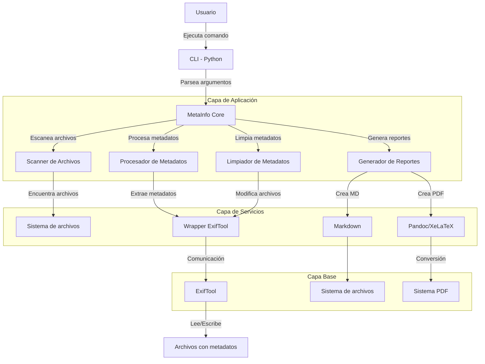

# MetaInfo

MetaInfo es una herramienta para inspeccionar y manipular metadatos de archivos. Permite generar informes detallados de metadatos y también eliminar metadatos de archivos de forma recursiva.

## Características

- **Análisis recursivo**: Procesa archivos en el directorio especificado y todas sus subcarpetas
- **Generación de informes**: Crea informes en formato Markdown y opcionalmente PDF
- **Limpieza de metadatos**: Elimina todos los metadatos o solo aquellos considerados sensibles
- **Detección multilingüe**: Detecta información sensible en español, inglés, francés, alemán, italiano y portugués
- **Formatos soportados**: Imágenes (JPG, PNG, GIF, WEBP, BMP), documentos (PDF, DOCX, ODT, XLS, XLSX, PPT, PPTX), multimedia (MP3, MP4, AVI, MOV, WMV, FLV) y más

## Basado en ExifTool

MetaInfo se basa en ExifTool, una potente biblioteca de código abierto que permite leer, escribir y manipular metadatos en una amplia variedad de archivos. ExifTool es capaz de extraer información técnica y metadatos de miles de tipos de archivo diferentes, incluyendo:

- Metadatos EXIF en imágenes (fecha, hora, configuración de cámara, ubicación GPS)
- Información de autor y copyright en documentos
- Datos técnicos en archivos multimedia
- Metadatos personalizados en diversos formatos de archivo

MetaInfo amplía las capacidades de ExifTool proporcionando una interfaz más amigable, generación automatizada de informes y funciones específicas para la detección y eliminación de información sensible.

## Arquitectura y Flujo de Ejecución

El siguiente diagrama muestra la arquitectura y el flujo de ejecución de MetaInfo:



Este diagrama representa:
1. El usuario interactúa con la interfaz de línea de comandos (CLI)
2. La aplicación parsea los argumentos y activa el núcleo de MetaInfo
3. MetaInfo utiliza diferentes módulos según la tarea solicitada
4. Estos módulos se comunican con servicios de nivel inferior
5. En la base, ExifTool realiza las operaciones de lectura/escritura de metadatos
6. Pandoc y XeLaTeX se utilizan opcionalmente para la generación de PDF

## Requisitos

- Python 3.6 o superior
- Biblioteca exiftool para Python (`pip install pyexiftool`)
- ExifTool instalado en el sistema (versión 12.15 o superior)
- Pandoc (opcional, para generación de PDF)
- XeLaTeX (opcional, para mejor formato en PDF)

## Instalación

### 1. Instalar ExifTool

#### En sistemas basados en Debian/Ubuntu:
```bash
sudo apt install libimage-exiftool-perl
```

#### En sistemas basados en RHEL/CentOS:
```bash
sudo yum install perl-Image-ExifTool
```

#### En Windows o Mac:
Descarga e instala desde la [página oficial de ExifTool](https://exiftool.org/)

### 2. Instalar Pandoc (opcional, para generación de PDF)

#### En sistemas basados en Debian/Ubuntu:
```bash
sudo apt install pandoc texlive-xetex
```

#### En sistemas basados en RHEL/CentOS:
```bash
sudo yum install pandoc texlive-xetex
```

#### En Windows o Mac:
Descarga e instala desde la [página oficial de Pandoc](https://pandoc.org/installing.html)

### 3. Clonar el repositorio e instalar dependencias de Python

```bash
git clone https://github.com/tu-usuario/metatool.git
cd metatool
pip install -r requirements.txt
```

## Uso

### Generar un informe completo de metadatos

```bash
python metainfo.py --i /ruta/a/carpeta --report_all
```

### Generar un informe solo con datos sensibles

```bash
python metainfo.py --i /ruta/a/carpeta --report_sensitive
```

### Generar un informe en PDF

```bash
python metainfo.py --i /ruta/a/carpeta --report_all --pdf
```

### Mostrar solo datos sensibles en el informe

```bash
python metainfo.py --i /ruta/a/carpeta --report_sensitive
```

### Limpiar todos los metadatos de archivos

```bash
python metainfo.py --i /ruta/a/carpeta --wipe_all
```

### Limpiar solo los metadatos sensibles de archivos

```bash
python metainfo.py --i /ruta/a/carpeta --wipe_sensitive
```

### Especificar una carpeta de salida

```bash
python metainfo.py --i /ruta/a/carpeta --o /ruta/salida --report_all
```

### Mostrar información detallada durante el proceso

```bash
python metainfo.py --i /ruta/a/carpeta --report_all --verbose
```

### Mostrar los patrones considerados sensibles

```bash
python metainfo.py --show_patterns
```

### Mostrar los tipos de archivo soportados

```bash
python metainfo.py --show_mimes
```

## Opciones

- `--i`: Ruta a la carpeta que se va a procesar (obligatorio excepto con --show_patterns y --show_mimes)
- `--o`: Ruta a la carpeta de salida para los informes (opcional, predeterminado: carpeta actual)
- `--report_all`: Genera un informe completo de metadatos (predeterminado: True)
- `--report_sensitive`: Genera un informe solo con datos sensibles (predeterminado: False)
- `--wipe_all`: Elimina todos los metadatos de los archivos
- `--wipe_sensitive`: Elimina solo los metadatos sensibles de los archivos
- `--pdf`: Genera también un informe en formato PDF (requiere Pandoc y XeLaTeX)
- `--md`: Genera un informe en formato Markdown (predeterminado: True)
- `--show_patterns`: Muestra los patrones considerados datos sensibles y sale
- `--show_mimes`: Muestra los tipos de archivo soportados y sale
- `--verbose`: Muestra información detallada durante el proceso

## Ejemplos de uso

### Analizar fotos de vacaciones y generar un PDF

```bash
python metainfo.py --i ~/Fotos/Vacaciones2023 --o ~/Informes --report_all --pdf
```

### Limpiar solo metadatos sensibles de documentos confidenciales

```bash
python metainfo.py --i ~/Documentos/Confidencial --wipe_sensitive --verbose
```

### Generar un informe mostrando solo información potencialmente sensible

```bash
python metainfo.py --i ~/Documentos --report_sensitive
```

## Detección de información sensible

MetaInfo incluye una amplia lista de patrones para detectar información potencialmente sensible en los metadatos de los archivos, en varios idiomas:

- **Español**: nombre, dirección, teléfono, DNI, contraseña, etc.
- **Inglés**: name, address, phone, password, SSN, etc.
- **Francés**: nom, adresse, téléphone, mot de passe, etc.
- **Alemán**: name, adresse, telefon, passwort, etc.
- **Italiano**: nome, indirizzo, telefono, password, etc.
- **Portugués**: nome, endereço, telefone, senha, etc.

También detecta metadatos específicos de dispositivos como números de serie de cámaras, información del creador, y más.

## Salida

- Los informes Markdown se guardan como `report.md` en la carpeta de salida
- Los informes PDF se guardan como `report.pdf` en la carpeta de salida

## Limitaciones

- La funcionalidad de limpieza de metadatos requiere que ExifTool esté instalado en el sistema
- La generación de PDF requiere Pandoc y XeLaTeX instalados

## Licencia

Este proyecto está licenciado bajo [AGPL-3.0](LICENSE)

## Contribuciones

Las contribuciones son bienvenidas. Por favor, envía un pull request o abre un issue para discutir los cambios propuestos. 