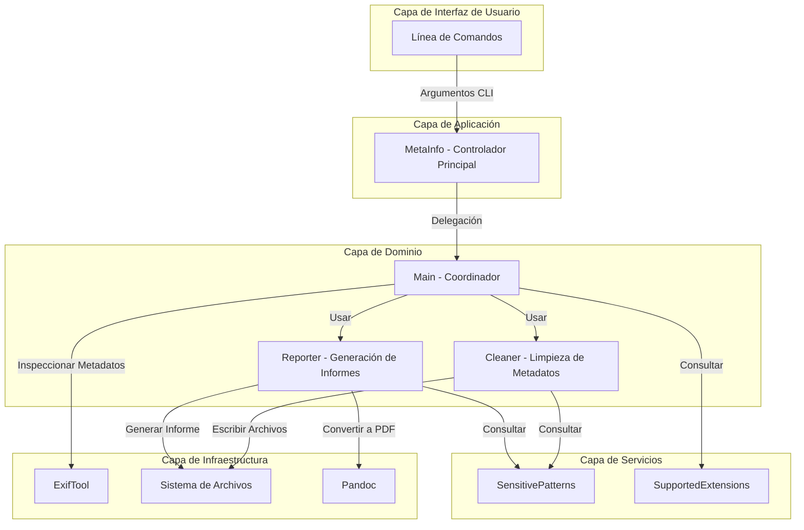

# Arquitectura de Capas de Metainfo

Este documento presenta la arquitectura por capas de la aplicación Metainfo.

## Diagrama de Arquitectura por Capas

## Descripción de las Capas

### Capa de Interfaz de Usuario
- **Línea de Comandos**: Proporciona la interfaz para interactuar con la aplicación mediante argumentos CLI.

### Capa de Aplicación
- **MetaInfo**: Actúa como controlador principal de la aplicación, procesando argumentos y delegando a las clases de dominio.

### Capa de Dominio
- **Main**: Coordina las operaciones principales, dirigiendo el flujo de trabajo entre componentes.
- **Reporter**: Responsable de generar informes con los metadatos analizados.
- **Cleaner**: Responsable de limpiar metadatos sensibles o todos los metadatos.

### Capa de Servicios
- **SensitivePatterns**: Define y gestiona los patrones considerados sensibles.
- **SupportedExtensions**: Define y gestiona las extensiones de archivo soportadas.

### Capa de Infraestructura
- **ExifTool**: Herramienta externa utilizada para extraer y manipular metadatos.
- **Sistema de Archivos**: Acceso a archivos y directorios para lectura y escritura.
- **Pandoc**: Herramienta externa para la conversión de documentos (Markdown a PDF).

## Flujo de Información

1. Los argumentos del usuario se reciben a través de la línea de comandos.
2. El controlador principal (MetaInfo) procesa estos argumentos y configura el entorno.
3. Las capas de dominio implementan la lógica principal, coordinando las operaciones solicitadas.
4. La capa de servicios proporciona funcionalidades especializadas.
5. La capa de infraestructura gestiona el acceso a herramientas y recursos externos.

Esta arquitectura por capas facilita la separación de responsabilidades y mejora la mantenibilidad del sistema. 