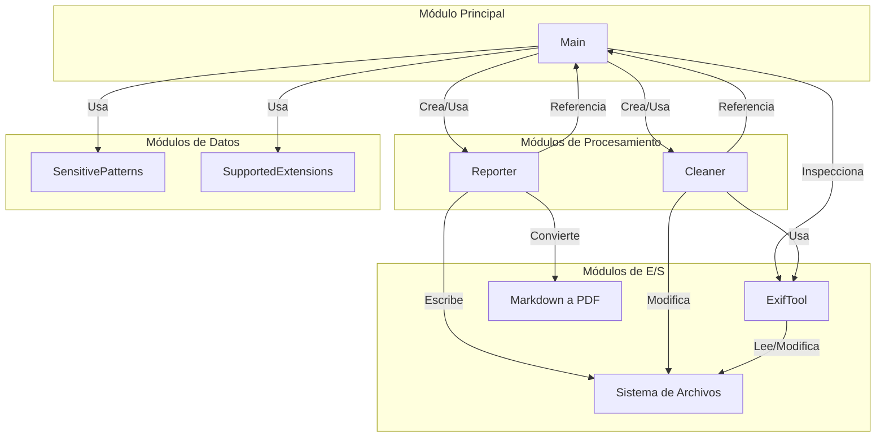

# Arquitectura Modular del Sistema MetaInfo

Este documento presenta la arquitectura modular del sistema MetaInfo, mostrando la organización de sus componentes y las interacciones entre ellos.

## Diagrama de Arquitectura Modular

## Descripción de la Arquitectura Modular

### Módulo Principal
- **Main**: Componente central que coordina todas las operaciones del sistema. Actúa como punto de entrada y controlador principal.

### Módulos de Procesamiento
- **Reporter**: Responsable de la generación de informes de metadatos. Transforma los datos recopilados en formatos legibles (Markdown, PDF).
- **Cleaner**: Encargado de la limpieza de metadatos. Puede eliminar todos los metadatos o solo aquellos considerados sensibles.

### Módulos de Datos
- **SensitivePatterns**: Define los patrones considerados sensibles para la detección en metadatos.
- **SupportedExtensions**: Especifica las extensiones de archivo que el sistema puede procesar.

### Módulos de Entrada/Salida
- **Sistema de Archivos**: Gestiona la lectura y escritura de archivos y directorios.
- **ExifTool**: Herramienta externa utilizada para la extracción y manipulación de metadatos.
- **Markdown a PDF**: Funcionalidad para convertir los informes de Markdown a PDF.

## Características de la Arquitectura

1. **Diseño Modular**: La aplicación está organizada en módulos con responsabilidades claramente definidas.

2. **Alta Cohesión**: Cada módulo agrupa funcionalidades relacionadas, maximizando la cohesión interna.

3. **Bajo Acoplamiento**: Los módulos se comunican a través de interfaces bien definidas, minimizando las dependencias directas.

4. **Separación de Responsabilidades**: Cada módulo tiene una responsabilidad única y bien definida.

5. **Reutilización de Código**: Los módulos de datos (SensitivePatterns, SupportedExtensions) son utilizados por múltiples componentes.

6. **Integración con Herramientas Externas**: La arquitectura incorpora herramientas externas (ExifTool) de manera modular, facilitando posibles reemplazos o actualizaciones.

## Ventajas de esta Arquitectura

- **Facilidad de Mantenimiento**: La organización modular facilita la localización y corrección de errores.
- **Escalabilidad**: Nuevas funcionalidades pueden agregarse como módulos adicionales sin afectar significativamente el sistema existente.
- **Testabilidad**: Cada módulo puede probarse de forma independiente, facilitando la implementación de pruebas unitarias.
- **Flexibilidad**: Los componentes pueden evolucionar de forma independiente, siempre que mantengan sus interfaces.
- **Claridad**: La estructura modular mejora la comprensión del sistema para nuevos desarrolladores. 