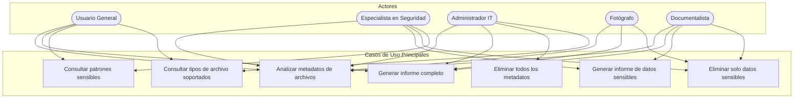

# Casos de Uso - MetaInfo

Este documento describe los principales casos de uso de la aplicación MetaInfo, mostrando cómo los diferentes tipos de usuarios interactúan con el sistema para lograr sus objetivos.

## Navegación de la Documentación

- [← Volver al Índice](indice.md)
- [Ver Diagrama de Clases](diagrama_clases.md)

## Diagrama de Casos de Uso



## Descripción Detallada de Casos de Uso

### UC1: Analizar metadatos de archivos

**Actores principales:** Todos los usuarios

**Descripción:** El usuario desea analizar los metadatos contenidos en archivos de un directorio para conocer qué información contienen.

**Precondiciones:**
- El usuario tiene instalado Python y las dependencias de MetaInfo
- El usuario tiene acceso a los archivos a analizar

**Flujo principal:**
1. El usuario ejecuta el comando con la ruta del directorio a analizar
2. El sistema escanea recursivamente todos los archivos con extensiones soportadas
3. Por cada archivo, el sistema extrae los metadatos
4. El sistema analiza cada campo de metadatos para detectar información sensible
5. El sistema genera estadísticas sobre los archivos procesados

**Flujos alternativos:**
- Si no se encuentra ExifTool, el sistema muestra un mensaje de error adecuado
- Si no hay archivos con extensiones soportadas, el sistema lo notifica al usuario

**Postcondiciones:**
- El sistema ha recopilado la información de metadatos de los archivos

**Ejemplo:**
```bash
python metainfo.py --i ~/Documentos --verbose
```

### UC2: Generar informe completo

**Actores principales:** Usuario General, Administrador IT, Fotógrafo, Documentalista

**Descripción:** El usuario desea generar un informe completo que incluya todos los metadatos encontrados en los archivos, sean sensibles o no.

**Precondiciones:**
- Se ha completado el análisis de metadatos (UC1)

**Flujo principal:**
1. El sistema compila toda la información de metadatos recopilada
2. El sistema genera un informe en formato Markdown
3. Si se solicita, el sistema convierte el informe a formato PDF
4. El sistema guarda el informe en la ubicación especificada

**Flujos alternativos:**
- Si se solicita PDF pero no está disponible Pandoc, se genera solo el informe Markdown con un aviso

**Postcondiciones:**
- Se ha generado un informe detallado con todos los metadatos

**Ejemplo:**
```bash
python metainfo.py --i ~/Fotos/Vacaciones --report_all --pdf --o ~/Informes
```

### UC3: Generar informe de datos sensibles

**Actores principales:** Especialista en Seguridad, Documentalista

**Descripción:** El usuario desea generar un informe que incluya solo los metadatos considerados sensibles, para evaluar riesgos de privacidad y seguridad.

**Precondiciones:**
- Se ha completado el análisis de metadatos (UC1)

**Flujo principal:**
1. El sistema filtra los metadatos para incluir solo aquellos identificados como sensibles
2. El sistema genera un informe en formato Markdown con los datos sensibles
3. Si se solicita, el sistema convierte el informe a formato PDF
4. El sistema guarda el informe en la ubicación especificada

**Flujos alternativos:**
- Si no se encuentran datos sensibles, se genera un informe indicando que no hay información sensible

**Postcondiciones:**
- Se ha generado un informe específico sobre los datos sensibles encontrados

**Ejemplo:**
```bash
python metainfo.py --i ~/Documentos/Confidencial --report_sensitive --o ~/Informes/Seguridad
```

### UC4: Eliminar todos los metadatos

**Actores principales:** Administrador IT

**Descripción:** El usuario desea eliminar todos los metadatos de los archivos para prepararlos para su distribución o publicación.

**Precondiciones:**
- El usuario tiene permisos de escritura en los archivos a procesar
- ExifTool está instalado en el sistema

**Flujo principal:**
1. El sistema identifica todos los archivos con extensiones soportadas
2. El sistema omite archivos de texto (.txt) que no tienen metadatos relevantes
3. Para cada archivo válido, el sistema elimina todos los metadatos utilizando estrategias apropiadas
4. El sistema verifica que la limpieza se haya realizado correctamente
5. El sistema notifica el progreso y resultado de la operación

**Flujos alternativos:**
- Si algún archivo está protegido contra escritura, el sistema lo notifica y continúa con los demás
- Si ExifTool no está disponible, el sistema muestra un error y detiene el proceso
- Si un método de limpieza falla, el sistema intenta métodos alternativos

**Postcondiciones:**
- Los archivos procesados ya no contienen metadatos
- Se mantiene un registro de cualquier error ocurrido durante el proceso

**Ejemplo:**
```bash
python metainfo.py --i ~/Documentos/ParaPublicar --wipe_all --verbose
```

### UC5: Eliminar solo datos sensibles

**Actores principales:** Especialista en Seguridad, Fotógrafo, Documentalista

**Descripción:** El usuario desea eliminar solo los metadatos clasificados como sensibles, manteniendo el resto de la información.

**Precondiciones:**
- El usuario tiene permisos de escritura en los archivos a procesar
- ExifTool está instalado en el sistema

**Flujo principal:**
1. El sistema identifica todos los archivos con extensiones soportadas
2. El sistema omite archivos de texto (.txt) que no tienen metadatos relevantes
3. Para cada archivo válido, el sistema extrae los metadatos
4. El sistema identifica qué campos contienen información sensible
5. El sistema elimina solo los campos sensibles mediante técnicas apropiadas
6. El sistema verifica que se hayan eliminado correctamente los campos sensibles
7. El sistema notifica el progreso y resultado de la operación

**Flujos alternativos:**
- Si no se encuentran datos sensibles en un archivo, el sistema lo notifica y continúa
- Si ExifTool no está disponible, el sistema muestra un error y detiene el proceso
- Si un método de limpieza falla, el sistema intenta métodos alternativos

**Postcondiciones:**
- Los archivos procesados no contienen metadatos sensibles, pero conservan el resto de la información
- Se mantiene un registro de cualquier error ocurrido durante el proceso

**Ejemplo:**
```bash
python metainfo.py --i ~/Fotos/Portfolio --wipe_sensitive --verbose
```

### UC6: Consultar patrones sensibles

**Actores principales:** Usuario General, Especialista en Seguridad

**Descripción:** El usuario desea conocer qué patrones son considerados sensibles por el sistema.

**Precondiciones:**
- Ninguna específica

**Flujo principal:**
1. El usuario solicita la lista de patrones sensibles
2. El sistema muestra todos los patrones organizados por idioma y tipo

**Postcondiciones:**
- El usuario conoce qué información es considerada sensible por el sistema

**Ejemplo:**
```bash
python metainfo.py --show_patterns
```

### UC7: Consultar tipos de archivo soportados

**Actores principales:** Usuario General, Administrador IT

**Descripción:** El usuario desea conocer qué tipos de archivo son soportados por la aplicación.

**Precondiciones:**
- Ninguna específica

**Flujo principal:**
1. El usuario solicita la lista de tipos de archivo soportados
2. El sistema muestra todas las extensiones soportadas organizadas por categoría

**Postcondiciones:**
- El usuario conoce qué tipos de archivo puede procesar el sistema

**Ejemplo:**
```bash
python metainfo.py --show_mimes
```

## Escenarios de Uso por Tipo de Usuario

### Perfil: Fotógrafo Profesional

**Escenario:** Un fotógrafo profesional necesita preparar una colección de fotografías para entregar a un cliente, asegurándose de que no contengan información personal o sensible.

**Secuencia típica:**
1. Analizar los metadatos de la colección de fotos para identificar qué información contienen
2. Generar un informe completo para revisar en detalle los metadatos presentes
3. Eliminar selectivamente los metadatos sensibles (como ubicación GPS, número de serie de la cámara, etc.)
4. Verificar que la limpieza se ha realizado correctamente

**Comandos utilizados:**
```bash
# Paso 1 y 2: Analizar y generar informe
python metainfo.py --i ~/Fotos/ClienteXYZ --report_all --o ~/Informes --pdf

# Paso 3: Eliminar metadatos sensibles
python metainfo.py --i ~/Fotos/ClienteXYZ --wipe_sensitive --verbose

# Paso 4: Verificar limpieza
python metainfo.py --i ~/Fotos/ClienteXYZ --report_sensitive
```

### Perfil: Especialista en Seguridad

**Escenario:** Un especialista en seguridad necesita auditar documentos corporativos para identificar posibles filtraciones de información sensible a través de metadatos.

**Secuencia típica:**
1. Consultar qué patrones son considerados sensibles para entender el alcance del análisis
2. Analizar los metadatos de los documentos corporativos
3. Generar un informe específico de datos sensibles para identificar riesgos
4. Recomendar o implementar la limpieza selectiva de información sensible

**Comandos utilizados:**
```bash
# Paso 1: Consultar patrones sensibles
python metainfo.py --show_patterns

# Paso 2 y 3: Analizar y generar informe de datos sensibles
python metainfo.py --i /datos/documentos_corporativos --report_sensitive --o /informes/auditoria --pdf

# Paso 4: Implementar limpieza selectiva
python metainfo.py --i /datos/documentos_corporativos --wipe_sensitive --verbose
```

### Perfil: Documentalista

**Escenario:** Un documentalista necesita organizar una colección de documentos históricos, preservando la información de autoría y fechas pero eliminando datos personales sensibles.

**Secuencia típica:**
1. Analizar los metadatos de la colección para entender qué información contienen
2. Generar un informe completo para catalogar la información de autoría, fechas, etc.
3. Identificar qué documentos contienen información sensible
4. Eliminar selectivamente los datos sensibles preservando la información histórica relevante

**Comandos utilizados:**
```bash
# Paso 1 y 2: Analizar y generar informe completo
python metainfo.py --i /coleccion/documentos_historicos --report_all --o /catalogos/metadatos --pdf

# Paso 3: Identificar documentos con datos sensibles
python metainfo.py --i /coleccion/documentos_historicos --report_sensitive --o /catalogos/revision_sensible

# Paso 4: Eliminar selectivamente los datos sensibles
python metainfo.py --i /coleccion/documentos_historicos --wipe_sensitive --verbose
```

## Relación con los Componentes del Sistema

Los casos de uso aquí descritos se implementan mediante los componentes detallados en el [Diagrama de Componentes](diagrama_componentes.md):

- **UC1** utiliza principalmente el **Analizador de Metadatos** y el **Detector de Datos Sensibles**
- **UC2** y **UC3** utilizan el **Sistema de Informes** y sus generadores específicos
- **UC4** y **UC5** utilizan el **Sistema de Limpieza** con sus estrategias específicas
- **UC6** utiliza la **Base de Patrones Sensibles**
- **UC7** utiliza la **Base de Extensiones Soportadas**

---

*Última actualización: 11/06/2024* 