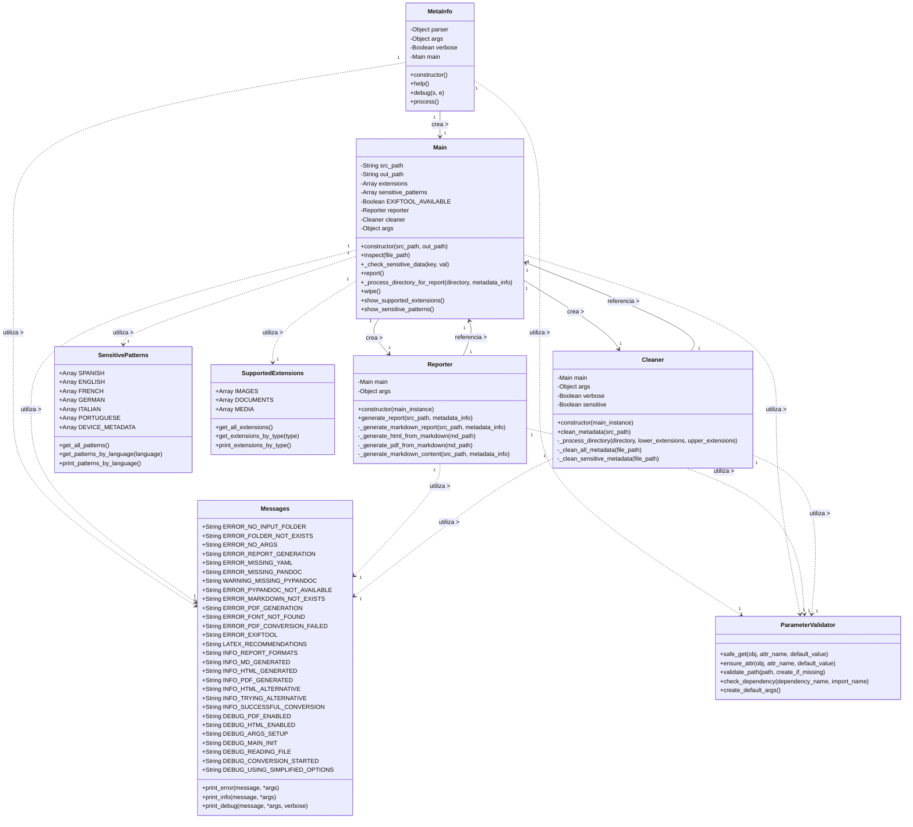

# Diagrama de Clases - MetaInfo

Este documento presenta el diseño estático de clases de la aplicación MetaInfo, describiendo sus atributos, métodos y relaciones.

## Navegación de la Documentación

- [← Volver al Índice](indice.md)
- [Ver Casos de Uso](casos_uso.md)

## Diagrama de Clases

## Descripción Detallada de Clases

### MetaInfo
La clase principal que maneja la entrada del usuario y coordina el procesamiento.

#### Atributos
- `parser`: Parser de argumentos
- `args`: Argumentos de línea de comandos
- `verbose`: Indica si se debe mostrar información detallada
- `main`: Instancia de la clase Main

#### Métodos
- `constructor`: Inicializa la aplicación, configura el parser y procesa argumentos
- `help`: Muestra la ayuda del programa
- `debug`: Muestra mensajes de depuración
- `process`: Procesa la solicitud del usuario según los argumentos

### Main
La clase central que coordina todas las operaciones. Contiene referencias a las clases `Reporter` y `Cleaner`.

#### Atributos
- `src_path`: Ruta del directorio a procesar
- `out_path`: Ruta de salida para los informes
- `extensions`: Lista de extensiones de archivo soportadas
- `sensitive_patterns`: Lista de patrones sensibles
- `EXIFTOOL_AVAILABLE`: Indica si la herramienta ExifTool está disponible
- `reporter`: Instancia de la clase Reporter
- `cleaner`: Instancia de la clase Cleaner
- `args`: Argumentos de línea de comandos

#### Métodos
- `constructor`: Inicializa la clase con las rutas de origen y destino
- `inspect`: Inspecciona un archivo para extraer sus metadatos
- `_check_sensitive_data`: Verifica si una clave o valor contiene datos sensibles
- `report`: Genera un informe de metadatos
- `_process_directory_for_report`: Procesa recursivamente un directorio para el informe
- `wipe`: Limpia los metadatos de los archivos
- `show_supported_extensions`: Muestra las extensiones soportadas
- `show_sensitive_patterns`: Muestra los patrones sensibles

### Reporter
Clase responsable de generar informes de metadatos en formatos Markdown, HTML y PDF.

#### Atributos
- `main`: Referencia a la instancia de Main
- `args`: Argumentos de línea de comandos

#### Métodos
- `constructor`: Inicializa la clase con una referencia a Main
- `generate_report`: Genera un informe basado en la información recopilada
- `_generate_markdown_report`: Genera el informe en formato Markdown
- `_generate_html_from_markdown`: Convierte el informe Markdown a HTML
- `_generate_pdf_from_markdown`: Convierte el informe Markdown a PDF con portada e índice
- `_generate_markdown_content`: Genera el contenido del informe en formato Markdown

### Cleaner
Clase responsable de limpiar metadatos de archivos.

#### Atributos
- `main`: Referencia a la instancia de Main
- `args`: Argumentos de línea de comandos
- `verbose`: Indicador de modo detallado
- `sensitive`: Indicador de modo de limpieza sensitiva

#### Métodos
- `constructor`: Inicializa la clase con una referencia a Main
- `clean_metadata`: Método principal que coordina la limpieza de metadatos
- `_process_directory`: Procesa recursivamente directorios
- `_clean_all_metadata`: Elimina todos los metadatos de un archivo
- `_clean_sensitive_metadata`: Elimina solo los metadatos sensibles

### Messages
Clase que centraliza todos los mensajes al usuario y proporciona métodos para mostrarlos.

#### Atributos (constantes)
- Múltiples constantes para diferentes categorías de mensajes
  
#### Métodos
- `print_error`: Imprime un mensaje de error formateado
- `print_info`: Imprime un mensaje informativo formateado
- `print_debug`: Imprime un mensaje de depuración formateado, solo si verbose es True

### ParameterValidator
Clase que proporciona métodos para validar parámetros y obtener valores seguros.

#### Métodos
- `safe_get`: Obtiene de forma segura el valor de un atributo
- `ensure_attr`: Asegura que un objeto tenga un atributo, asignándole un valor por defecto si no existe
- `validate_path`: Valida que una ruta exista, opcionalmente creándola si no existe
- `check_dependency`: Verifica si una dependencia está instalada
- `create_default_args`: Crea un objeto con valores por defecto para los argumentos

### SensitivePatterns
Clase que define los patrones considerados sensibles para detectar en metadatos.

#### Atributos (constantes)
- Listas de patrones sensibles en varios idiomas
- Lista de metadatos específicos de dispositivos

#### Métodos
- `get_all_patterns`: Obtiene todos los patrones sensibles
- `get_patterns_by_language`: Obtiene los patrones para un idioma específico
- `print_patterns_by_language`: Imprime los patrones agrupados por idioma

### SupportedExtensions
Clase que define las extensiones de archivo soportadas.

#### Atributos (constantes)
- Listas de extensiones por categoría

#### Métodos
- `get_all_extensions`: Obtiene todas las extensiones soportadas
- `get_extensions_by_type`: Obtiene las extensiones para un tipo específico
- `print_extensions_by_type`: Imprime las extensiones agrupadas por tipo

## Relaciones entre Clases

- `MetaInfo` crea y configura la instancia de `Main`, que es el núcleo del sistema.
- `Main` crea y mantiene instancias de `Reporter` y `Cleaner`.
- `Main`, `Reporter` y `Cleaner` utilizan `Messages` para mostrar mensajes al usuario.
- `Main`, `Reporter` y `Cleaner` utilizan `ParameterValidator` para validar y obtener valores seguros.
- `Main` utiliza las clases `SensitivePatterns` y `SupportedExtensions` para obtener datos constantes.
- `Reporter` y `Cleaner` mantienen referencias a la instancia de `Main` para acceder a sus métodos y atributos.
- No hay herencia entre clases, se utiliza composición para la reutilización de código.

## Correspondencia con el Diagrama de Componentes

Este diagrama de clases implementa los componentes de alto nivel definidos en el [Diagrama de Componentes](diagrama_componentes.md):

- La clase `MetaInfo` implementa la **Interfaz de Línea de Comandos**
- La clase `Main` implementa el **Núcleo de Aplicación**
- La clase `Reporter` implementa el **Sistema de Informes**
- La clase `Cleaner` implementa el **Sistema de Limpieza**
- La funcionalidad dentro de `Main` implementa el **Analizador de Metadatos** y **Detector de Datos Sensibles**
- Las clases `SensitivePatterns` y `SupportedExtensions` implementan las **Bases de Conocimiento**

---

*Última actualización: 11/06/2024* 