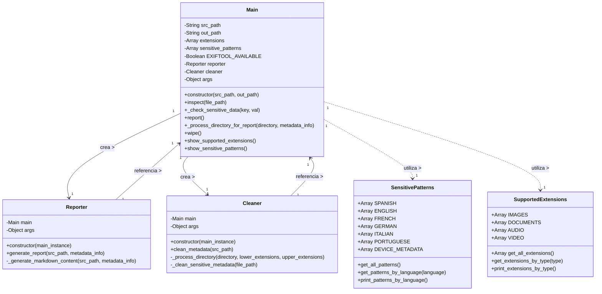

# Diagrama de Clases - MetaInfo

Este documento presenta el diseño estático de clases de la aplicación MetaInfo, describiendo sus atributos, métodos y relaciones.

## Diagrama de Clases

## Descripción Detallada de Clases

### Main
La clase principal que coordina todas las operaciones. Contiene referencias a las clases `Reporter` y `Cleaner`.

#### Atributos
- `src_path`: Ruta del directorio a procesar
- `out_path`: Ruta de salida para los informes
- `extensions`: Lista de extensiones de archivo soportadas
- `sensitive_patterns`: Lista de patrones sensibles
- `EXIFTOOL_AVAILABLE`: Indica si la herramienta ExifTool está disponible
- `reporter`: Instancia de la clase Reporter
- `cleaner`: Instancia de la clase Cleaner
- `args`: Argumentos de línea de comandos

#### Métodos
- `constructor`: Inicializa la clase con las rutas de origen y destino
- `inspect`: Inspecciona un archivo para extraer sus metadatos
- `_check_sensitive_data`: Verifica si una clave o valor contiene datos sensibles
- `report`: Genera un informe de metadatos
- `_process_directory_for_report`: Procesa recursivamente un directorio para el informe
- `wipe`: Limpia los metadatos de los archivos
- `show_supported_extensions`: Muestra las extensiones soportadas
- `show_sensitive_patterns`: Muestra los patrones sensibles

### Reporter
Clase responsable de generar informes de metadatos en formatos Markdown y PDF.

#### Atributos
- `main`: Referencia a la instancia de Main
- `args`: Argumentos de línea de comandos

#### Métodos
- `constructor`: Inicializa la clase con una referencia a Main
- `generate_report`: Genera un informe basado en la información recopilada
- `_generate_markdown_content`: Genera el contenido del informe en formato Markdown

### Cleaner
Clase responsable de limpiar metadatos de archivos.

#### Atributos
- `main`: Referencia a la instancia de Main
- `args`: Argumentos de línea de comandos

#### Métodos
- `constructor`: Inicializa la clase con una referencia a Main
- `clean_metadata`: Limpia los metadatos de los archivos en un directorio
- `_process_directory`: Procesa recursivamente un directorio para limpiar metadatos
- `_clean_sensitive_metadata`: Limpia solo los metadatos sensibles de un archivo

### SensitivePatterns
Clase que define los patrones considerados sensibles para detectar en metadatos.

#### Atributos (constantes)
- `SPANISH`: Lista de patrones sensibles en español
- `ENGLISH`: Lista de patrones sensibles en inglés
- `FRENCH`: Lista de patrones sensibles en francés
- `GERMAN`: Lista de patrones sensibles en alemán
- `ITALIAN`: Lista de patrones sensibles en italiano
- `PORTUGUESE`: Lista de patrones sensibles en portugués
- `DEVICE_METADATA`: Lista de metadatos específicos de dispositivos

#### Métodos
- `get_all_patterns`: Obtiene todos los patrones sensibles
- `get_patterns_by_language`: Obtiene los patrones para un idioma específico
- `print_patterns_by_language`: Imprime los patrones agrupados por idioma

### SupportedExtensions
Clase que define las extensiones de archivo soportadas.

#### Atributos (constantes)
- `IMAGES`: Lista de extensiones de imágenes
- `DOCUMENTS`: Lista de extensiones de documentos
- `AUDIO`: Lista de extensiones de audio
- `VIDEO`: Lista de extensiones de video

#### Métodos
- `get_all_extensions`: Obtiene todas las extensiones soportadas
- `get_extensions_by_type`: Obtiene las extensiones para un tipo específico
- `print_extensions_by_type`: Imprime las extensiones agrupadas por tipo

## Relaciones entre Clases

- `Main` crea y mantiene instancias de `Reporter` y `Cleaner`.
- `Main` utiliza las clases `SensitivePatterns` y `SupportedExtensions` para obtener datos constantes.
- `Reporter` y `Cleaner` mantienen referencias a la instancia de `Main` para acceder a sus métodos y atributos.
- No hay herencia entre clases, se utiliza composición para la reutilización de código. 