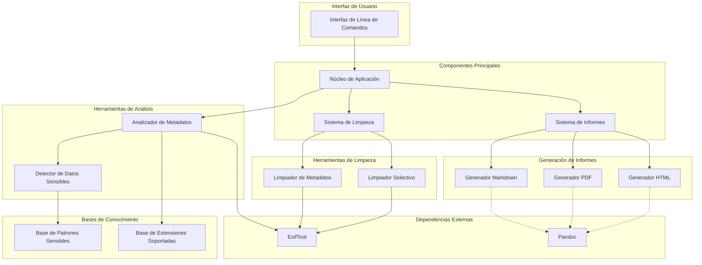

# Diagrama de Componentes - MetaInfo

Este documento presenta una visión de alto nivel de los componentes principales del sistema MetaInfo y sus interacciones.

## Diagrama de Componentes

## Descripción de Componentes

### Interfaz de Usuario
- **Interfaz de Línea de Comandos**: Componente que maneja la interacción con el usuario, procesa argumentos y muestra resultados.

### Componentes Principales
- **Núcleo de Aplicación**: Coordina todos los componentes del sistema y gestiona el flujo de trabajo.
- **Sistema de Informes**: Maneja la generación de informes en diferentes formatos.
- **Sistema de Limpieza**: Gestiona los procesos de limpieza de metadatos.

### Herramientas de Análisis
- **Analizador de Metadatos**: Extrae y procesa metadatos de diferentes tipos de archivos.
- **Detector de Datos Sensibles**: Identifica información sensible en los metadatos.

### Generación de Informes
- **Generador Markdown**: Crea informes en formato Markdown.
- **Generador PDF**: Convierte informes Markdown a PDF para distribución formal.
- **Generador HTML**: Convierte informes Markdown a HTML para visualización web.

### Herramientas de Limpieza
- **Limpiador de Metadatos**: Elimina todos los metadatos de los archivos.
- **Limpiador Selectivo**: Elimina solo los metadatos identificados como sensibles.

### Dependencias Externas
- **ExifTool**: Herramienta externa utilizada para leer y modificar metadatos.
- **Pandoc**: Herramienta externa utilizada para convertir entre formatos de documento.

### Bases de Conocimiento
- **Base de Patrones Sensibles**: Contiene patrones predefinidos para identificar información sensible.
- **Base de Extensiones Soportadas**: Define qué tipos de archivo son compatibles con el sistema.

## Interacciones Principales

1. El usuario interactúa con el sistema a través de la **Interfaz de Línea de Comandos**.
2. El **Núcleo de Aplicación** interpreta los comandos y coordina el flujo de trabajo.
3. Para analizar metadatos:
   - El **Analizador de Metadatos** utiliza **ExifTool** para extraer información.
   - El **Detector de Datos Sensibles** compara los metadatos con la **Base de Patrones Sensibles**.
4. Para generar informes:
   - El **Sistema de Informes** recopila la información analizada.
   - Los generadores de formato (**Markdown**, **PDF**, **HTML**) crean los documentos solicitados.
5. Para limpiar metadatos:
   - El **Sistema de Limpieza** determina qué tipo de limpieza realizar.
   - El **Limpiador de Metadatos** o **Limpiador Selectivo** ejecuta la limpieza utilizando **ExifTool**.

## Características de Arquitectura

- **Modularidad**: Los componentes están diseñados para funcionar de manera independiente con interfaces claras.
- **Extensibilidad**: Cada componente puede ser extendido sin afectar al resto del sistema.
- **Robustez**: Implementación de manejo de errores en cada componente para garantizar la estabilidad.
- **Bajo Acoplamiento**: Las dependencias entre componentes están minimizadas para facilitar mantenimiento y pruebas.

## Relación con el Diagrama de Clases

Este diagrama de componentes proporciona una visión de alto nivel del sistema, mientras que el [Diagrama de Clases](diagrama_clases.md) ofrece un detalle más fino sobre la implementación concreta de estas funcionalidades en clases y sus relaciones.

---

*Última actualización: 11/06/2024* 