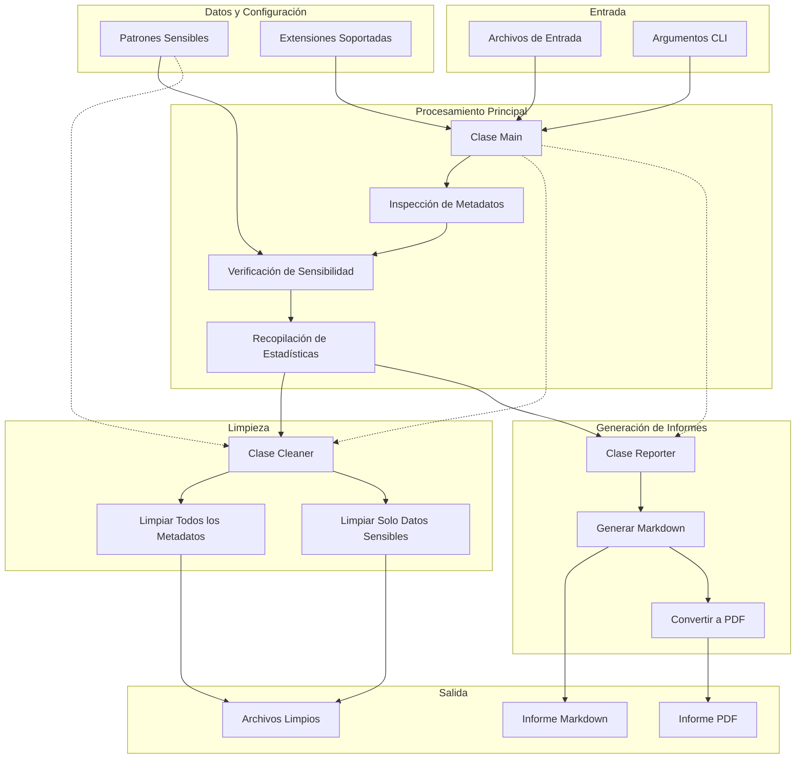

# Diagrama de Flujo de Datos - MetaInfo

Este documento presenta el flujo de datos en la aplicación MetaInfo, mostrando cómo se procesa la información desde su entrada hasta la generación de informes o limpieza de metadatos.

## Diagrama de Flujo de Datos

## Explicación del Flujo de Datos

### Entrada
- **Archivos de Entrada**: Los archivos y directorios que serán procesados por la aplicación.
- **Argumentos CLI**: Los parámetros proporcionados por el usuario a través de la línea de comandos.

### Procesamiento Principal
- **Clase Main**: Coordina todo el flujo de trabajo.
- **Inspección de Metadatos**: Extrae los metadatos de cada archivo usando ExifTool.
- **Verificación de Sensibilidad**: Comprueba si los metadatos contienen información sensible.
- **Recopilación de Estadísticas**: Agrupa y procesa los metadatos para generar estadísticas.

### Datos y Configuración
- **Patrones Sensibles**: Lista de patrones que se consideran sensibles.
- **Extensiones Soportadas**: Lista de extensiones de archivo que pueden ser procesadas.

### Bifurcación del Flujo
Después del procesamiento principal, el flujo se divide según la operación solicitada:

#### Ruta de Limpieza
- **Clase Cleaner**: Gestiona el proceso de limpieza.
- **Limpiar Todos los Metadatos**: Elimina todos los metadatos de los archivos.
- **Limpiar Solo Datos Sensibles**: Elimina solo los metadatos considerados sensibles.
- **Archivos Limpios**: Los archivos resultantes después del proceso de limpieza.

#### Ruta de Reporte
- **Clase Reporter**: Gestiona la generación de informes.
- **Generar Markdown**: Crea un informe en formato Markdown.
- **Convertir a PDF**: Opcionalmente convierte el informe Markdown a PDF.
- **Informe Markdown**: El informe generado en formato Markdown.
- **Informe PDF**: El informe generado en formato PDF (opcional).

## Características del Flujo de Datos

1. **Procesamiento Recursivo**: La aplicación procesa directorios de forma recursiva, examinando todos los archivos con extensiones soportadas.

2. **Procesamiento Condicional**: Dependiendo de los argumentos de entrada, se activan diferentes rutas de procesamiento.

3. **Verificación en Dos Pasos**: La sensibilidad se verifica tanto en las claves como en los valores de los metadatos.

4. **Procesamiento Estadístico**: Se recopilan estadísticas sobre los archivos procesados, lo que permite generar informes detallados.

5. **Salidas Múltiples**: El sistema puede generar diferentes tipos de salida (archivos limpios, informes en diferentes formatos) según las necesidades del usuario. 