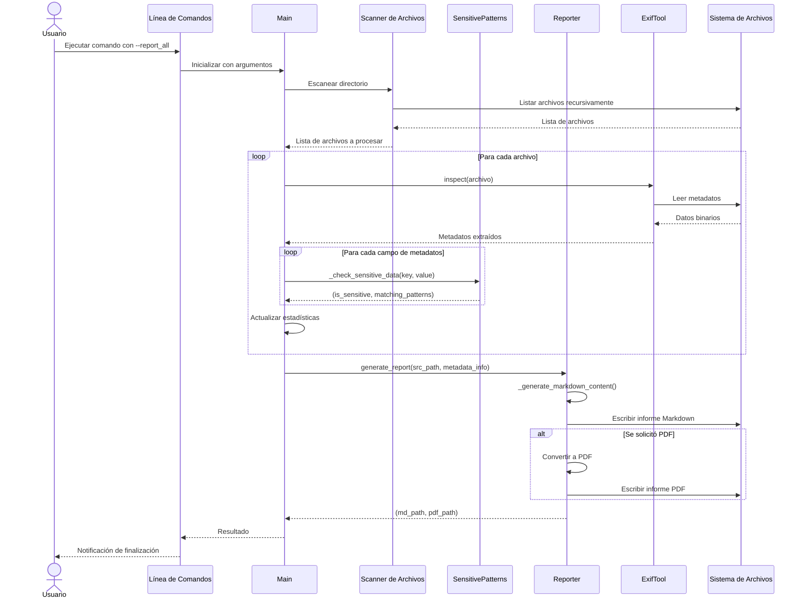
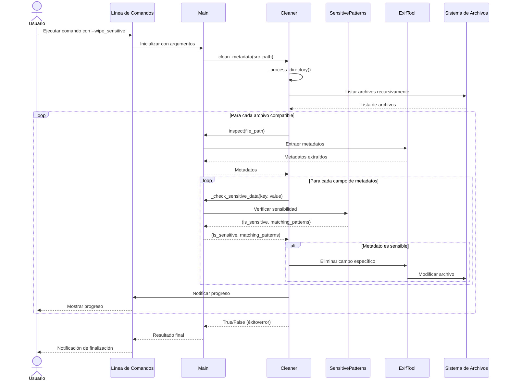
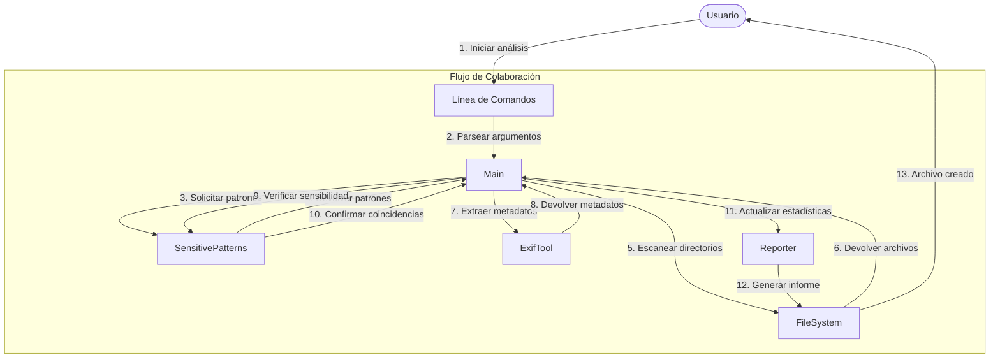
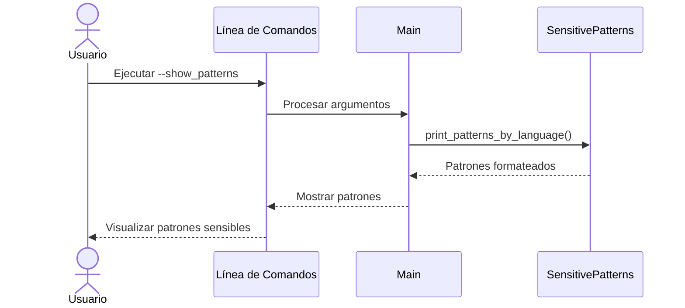
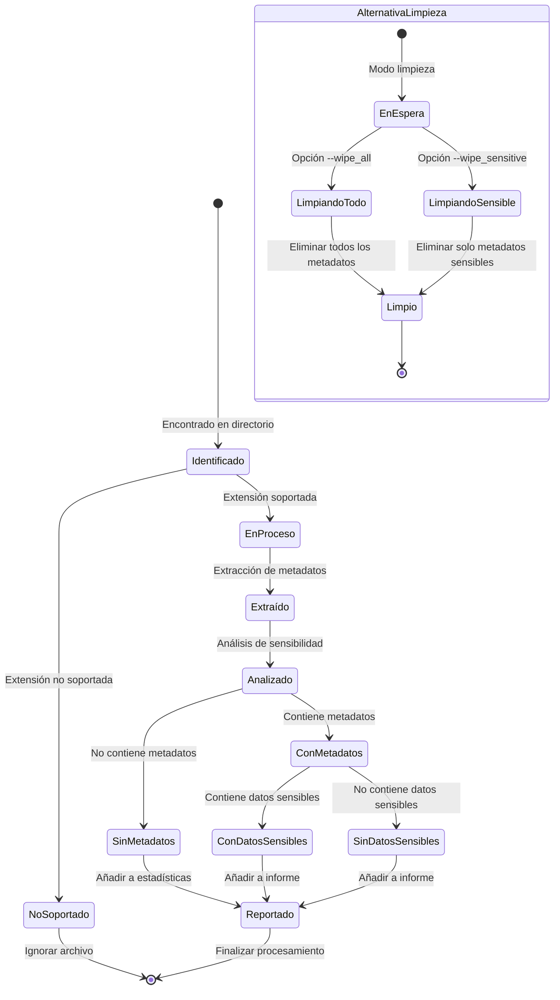
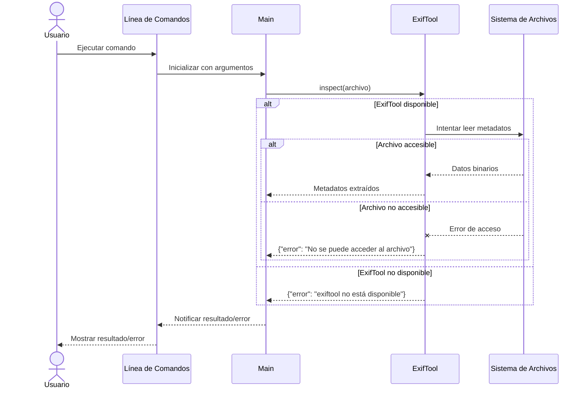

# Diagramas de Interacción - MetaInfo

Este documento presenta diagramas de interacción que muestran el comportamiento dinámico del sistema, ilustrando cómo los distintos componentes de MetaInfo colaboran para realizar las tareas principales.

## Diagrama de Secuencia: Generación de Informe

El siguiente diagrama muestra la secuencia de interacciones entre componentes para generar un informe de metadatos.

## Diagrama de Secuencia: Limpieza de Metadatos Sensibles

El siguiente diagrama muestra la secuencia de interacciones para eliminar metadatos sensibles de los archivos.

## Diagrama de Colaboración: Detección de Datos Sensibles

El siguiente diagrama muestra cómo colaboran los objetos durante el proceso de detección de datos sensibles.

## Diagrama de Secuencia: Consulta de Patrones Sensibles

El siguiente diagrama muestra la interacción cuando un usuario consulta los patrones sensibles.

## Diagrama de Estados: Procesamiento de un Archivo

El siguiente diagrama muestra los estados por los que pasa un archivo durante su procesamiento.

## Diagrama de Secuencia: Caso de Error en la Extracción de Metadatos

El siguiente diagrama muestra cómo el sistema maneja situaciones de error durante la extracción de metadatos.

## Explicación de los Diagramas

### Generación de Informe
Este diagrama muestra cómo el sistema procesa una solicitud para generar un informe. Ilustra el flujo desde la entrada del comando hasta la generación del archivo de informe, mostrando cómo se escanean los archivos, se extraen y analizan los metadatos, y se genera el informe.

### Limpieza de Metadatos Sensibles
Este diagrama detalla el proceso de limpieza selectiva de metadatos sensibles. Muestra cómo se identifica la información sensible y cómo se elimina mientras se preserva el resto de los metadatos.

### Detección de Datos Sensibles
Este diagrama de colaboración muestra las interacciones entre los diferentes componentes durante el proceso de detección de datos sensibles, destacando el flujo de la información y la colaboración entre objetos.

### Consulta de Patrones Sensibles
Este diagrama simple muestra la interacción cuando un usuario solicita ver los patrones considerados sensibles por el sistema.

### Estados de Procesamiento de un Archivo
Este diagrama de estados ilustra los diferentes estados por los que puede pasar un archivo durante su procesamiento, desde su identificación inicial hasta el informe final o la limpieza.

### Manejo de Errores
El último diagrama muestra cómo el sistema maneja situaciones de error durante la extracción de metadatos, ya sea por la falta de disponibilidad de ExifTool o por problemas al acceder a los archivos. 