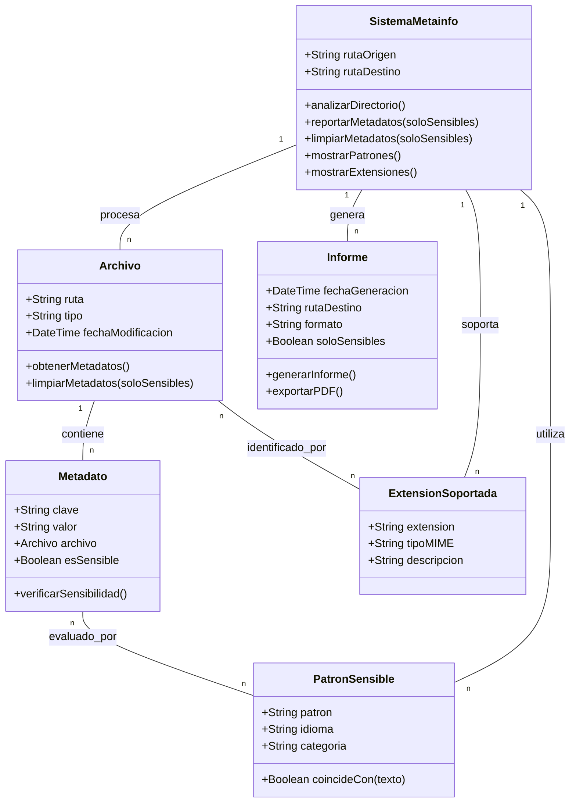

# Modelo de Dominio de Metainfo

Este documento presenta el modelo de dominio de la aplicación Metainfo, mostrando las entidades principales y sus relaciones.

## Diagrama de Modelo de Dominio

## Explicación de las Entidades

### Archivo
Representa un archivo físico en el sistema que puede ser procesado por Metainfo.

### Metadato
Representa un par clave-valor de metadatos extraídos de un archivo.

### PatronSensible
Define los patrones que se utilizan para identificar información potencialmente sensible.

### ExtensionSoportada
Define las extensiones de archivo que son soportadas por la aplicación.

### Informe
Representa un informe generado con los metadatos analizados.

### SistemaMetainfo
Representa el sistema completo que coordina todas las operaciones.

## Relaciones Principales

- Un **Archivo** contiene múltiples **Metadatos**.
- Cada **Metadato** es evaluado por múltiples **PatronesSensibles** para determinar si contiene información sensible.
- Un **Archivo** es identificado por su **ExtensionSoportada**.
- El **SistemaMetainfo** procesa múltiples **Archivos**.
- El **SistemaMetainfo** genera múltiples **Informes**.
- El **SistemaMetainfo** utiliza **PatronesSensibles** y soporta **ExtensionesCompatibles**. 